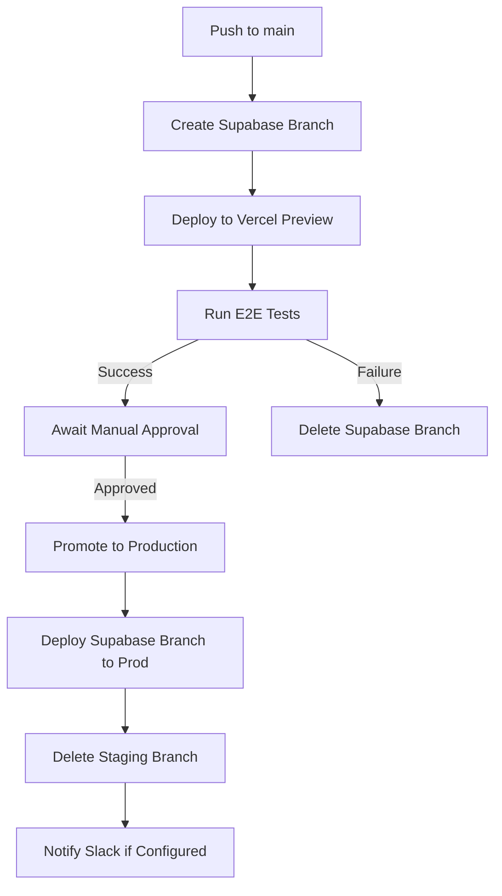

# DOCK108 Home


Umbrella site for DOCK108 developer tools.

Built with Next.js (App Router), TypeScript, Tailwind CSS, shadcn/ui, Supabase, and Resend.

## Included Products (v0.1.0)

- **/ (Homepage)**: Overview and links to products.
- **/crondeck**: Cron job & schedule monitoring.
- **/blog**: Developer blog posts on fraud, security, and platform development.
- **/docs**: Documentation site for DOCK108 products.

## Development Environment

- Node.js: v20 (or as specified in `.nvmrc`/`package.json`)
- Supabase Project (for waitlist database)
- Resend Account (for email sending)

## Getting Started

1.  **Environment Variables:**
    Copy `.env.example` to `.env.local` and add your Supabase and Resend keys:

    ```
    # See .env.example for all required variables
    NEXT_PUBLIC_SUPABASE_URL=...
    NEXT_PUBLIC_SUPABASE_ANON_KEY=...
    RESEND_API_KEY=...
    # Additional variables needed for specific features
    ```

    > **Note:** Environment files are not in repo; create them locally using values printed by setup scripts.

2.  **Install Dependencies:**

    ```bash
    npm install
    ```

3.  **Run Development Server:**

    ```bash
    npm run dev
    ```

    Open [http://localhost:3000](http://localhost:3000) in your browser.

## Database Setup (If applicable)

If you're working with features requiring a database (e.g., CronDeck waitlist):

1. **Start Supabase Local Development:**

   ```bash
   npm run supabase:start
   ```

2. **Apply Migrations (if needed):**
   If you have database migrations relevant to your feature:
   ```bash
   supabase db reset
   ```

### Local Supabase Setup

For CronDeck, we've set up a Supabase project with authentication and database tables:

1. **Project Details:**
   - Project ID: htvcpivmlntnaabmlxju
   - Region: us-east-1
   - Organization: dock108 (dmlbqbgdmahwdgydirzm)

2. **Tables:**
   - `waitlist`: Stores email sign-ups (no auth required)
   - `users`: Authenticated users and plan tiers
   - `jobs`: Cron job metadata with RLS policies

3. **Authentication:**
   - Email/password authentication is enabled
   - Site URL: http://localhost:3000
   - Additional URLs: http://127.0.0.1:3000

4. **Required Environment Variables:**
   - `NEXT_PUBLIC_SUPABASE_URL`: Project URL (https://htvcpivmlntnaabmlxju.supabase.co)
   - `NEXT_PUBLIC_SUPABASE_ANON_KEY`: Public API key for client-side operations
   - `SUPABASE_SERVICE_ROLE_KEY`: Private key for server-side operations (use with caution)

5. **Local Testing:**
   When running locally with `supabase start`, email magic links are captured by Inbucket:
   ```bash
   # Check status of local Supabase services
   supabase status
   # View URL where local emails are captured
   # Usually http://localhost:54324
   ```

6. **Running locally → Auth flow:**
   - Visit `/dashboard` → redirects to `/login` if not authenticated
   - Enter email/password → authentication handled by Supabase
   - On success → redirects to `/auth/callback` → lands on `/dashboard`
   - Dashboard shows your email and persists after refresh
   - Sign out returns to landing page

### Authentication Implementation Details

The CronDeck application uses Supabase Authentication with email/password credentials:

1. **Authentication Flow:**
   - Authentication is handled via Supabase Auth using the `@supabase/auth-helpers-nextjs` library
   - Protected routes are secured with middleware that checks for valid sessions
   - Detailed flow diagram available in `docs/flow.md`

2. **Key Components:**
   - `middleware.ts`: Handles authentication checks for protected routes
   - `app/auth/callback/route.ts`: Processes authentication callbacks
   - `components/auth/LoginForm.tsx`: Handles user login
   - `app/(protected)/layout.tsx`: Wraps all protected routes with auth checks

3. **Protected Routes:**
   - `/dashboard/*`: All dashboard pages require authentication
   - `/settings/*`: User settings pages require authentication
   
4. **Row Level Security:**
   - The `jobs` table uses RLS policies to ensure users can only access their own data
   - The RLS policy uses the authenticated user's ID to filter records

5. **Authentication Methods:**
   - Email/password authentication is the primary method
   - Magic link authentication also available as a fallback

For a complete diagram of the authentication flow, see `docs/flow.md`.

**Status:** ✅ Authentication is working correctly with proper session handling and protected routes.

## Available Scripts

- `npm run dev`: Starts the development server.
- `npm run lint`: Lints the codebase using Next.js ESLint config.
- `npm run format`: Formats code using Prettier.
- `npm run build`: Creates an optimized production build.
- `npm start`: Starts the production server (requires `npm run build` first).

## Testing

### Unit Tests

Unit tests use Jest and can be run with `npm test`.

### End-to-End Tests

We use Playwright for lightweight smoke tests that verify our key marketing pages load correctly:

```bash
# Run in headless mode
npm run test:e2e

# Run in debug mode with browser UI
PWDEBUG=1 npm run test:e2e
```

See `/tests/e2e/README.md` for more details on e2e tests.

## Deployment

This project is intended for deployment on Vercel. Ensure environment variables for Supabase and Resend are set in the Vercel project settings.

### Deployment Workflow

Automated CI/CD via GitHub Actions ensures reliable deployments:



1. **Staging**: Every push to `main` creates a clean staging environment.
2. **Testing**: E2E tests run against the staging environment.
3. **Approval**: A manual approval step allows verification.
4. **Production**: Upon approval, the staging environment is promoted to production.

## 🚀 Deploying to Vercel

1. Duplicate `.env.example` → `.env` and fill in the required secrets.
2. Push the secrets to Vercel:

```bash
npm run vercel:env
```

3. Deploy the app:

```bash
vercel --prod
```

Supabase Edge Functions (if used) need to be deployed separately using the Supabase CLI.

- [Next.js Documentation](https://nextjs.org/docs) - learn about Next.js features and API.
- [Learn Next.js](https://nextjs.org/learn) - an interactive Next.js tutorial.

You can check out [the Next.js GitHub repository](https://github.com/vercel/next.js) - your feedback and contributions are welcome!

## Deploy on Vercel

The easiest way to deploy your Next.js app is to use the [Vercel Platform](https://vercel.com/new?utm_medium=default-template&filter=next.js&utm_source=create-next-app&utm_campaign=create-next-app-readme) from the creators of Next.js.

Check out our [Next.js deployment documentation](https://nextjs.org/docs/app/building-your-application/deploying) for more details.

## Documentation

The documentation site lives under `/docs` and is built using MDX for content with a Next.js-based system that provides responsive sidebar navigation and full-text search.

### Running Documentation Locally

```
npm run docs:dev
```

This starts a development server for the documentation site, usually on a different port (e.g., 3001).

### Building Documentation

```
npm run docs:build
```

Generates a static build of the documentation under `out/docs`.

### Docs Linting

```
npm run docs:lint
```

Checks documentation Markdown files for common issues like broken links or incorrect syntax.

## Tooling & Conventions

- **State Management**: Primarily component state (`useState`, `useReducer`). For complex shared state, consider Zustand or React Query.
- **Styling**: Tailwind CSS with `tailwind-merge` and `clsx` (`@/lib/utils/cn`).
- **UI Components**: `shadcn/ui` (non-vendored, added via CLI).
- **Forms**: React Hook Form with Zod for validation.
- **Linting**: ESLint with Next.js + Prettier configs.
- **Commit Messages**: Conventional Commits enforced by `commitlint` via `husky`.
- **Database**: Supabase (PostgreSQL) accessed via `@supabase/ssr` and `@supabase/auth-helpers-nextjs`.
- **Email**: Resend.

### Directory Structure

- `app/`: App Router routes, layouts, loading states, etc.
- `components/`: Shared React components.
  - `components/ui/`: shadcn/ui components.
- `lib/`: Core utilities, helper functions, library configurations.
- `utils/`: Supabase client helpers, other specific utilities.
- `types/`: TypeScript type definitions (e.g., `supabase.ts`).
- `styles/`: Global CSS files.
- `public/`: Static assets.
- `content/`: Markdown content (e.g., blog posts).
- `scripts/`: Node.js helper scripts for development/build tasks.
- `docs/`: MDX content and configuration for the documentation site.

## Contributing

Please follow Conventional Commits format for commit messages. Use `npm run format` and `npm run lint` before committing.
