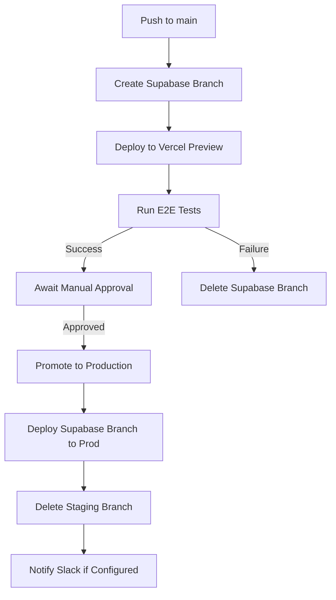
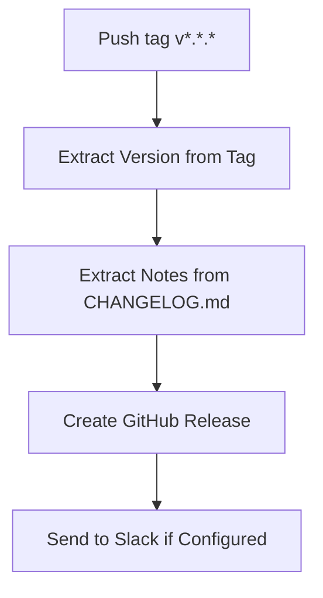

# Guardian CI/CD Pipeline

This document describes the CI/CD pipeline for deploying Guardian to staging and production environments. The pipeline is implemented using GitHub Actions, Vercel CLI, and Supabase Branches.

## Overview

The Guardian CI/CD pipeline consists of three main workflows:

1. **Staging Deployment (`staging.yml`)**: Creates a clean staging environment with a dedicated Supabase branch and Vercel preview deployment, then runs E2E tests against it.
2. **Production Promotion (`production-promote.yml`)**: Promotes a successful staging environment to production after a manual approval step.
3. **Release Notes (`release-notes.yml`)**: Extracts release notes from CHANGELOG.md when a new tag is pushed and creates a GitHub Release.

## Workflow Diagrams

### Staging to Production Flow



### Release Flow



## Required Secrets and Environment Variables

The following secrets must be configured in your GitHub repository settings:

| Secret                  | Description                                           |
| ----------------------- | ----------------------------------------------------- |
| `SUPABASE_CI_TOKEN`     | Supabase Personal Access Token with branch privileges |
| `VERCEL_TOKEN`          | Vercel deployment token                               |
| `STRIPE_TEST_KEY`       | Stripe test API key (for E2E tests)                   |
| `SLACK_RELEASE_WEBHOOK` | Optional: Slack webhook URL for release notifications |

The following repository variables can be configured:

| Variable              | Description                | Default                        |
| --------------------- | -------------------------- | ------------------------------ |
| `SUPABASE_PROJECT_ID` | ID of the Supabase project | (required)                     |
| `VERCEL_SCOPE`        | Vercel team or user scope  | (defaults to repository owner) |
| `PRODUCTION_URL`      | URL of the production site | `https://dock108.ai`           |

## Staging Deployment Process

The staging deployment workflow is triggered by:

- Pushes to the `main` branch
- Manual trigger via GitHub Actions UI

The workflow:

1. Creates a Supabase branch named `staging-{commit-sha}`
2. Runs all migrations on the Supabase branch
3. Creates a Vercel preview deployment connected to the Supabase branch
4. Runs E2E tests against the preview deployment
5. On test success, awaits manual approval to deploy to production
6. On test failure, deletes the Supabase branch to clean up resources

## Production Promotion Process

The production promotion workflow is triggered by:

- Successful staging deployment (requires manual approval)
- Manual trigger via GitHub Actions UI (requires input parameters)

The workflow:

1. Requires manual approval in GitHub environment
2. Promotes the Vercel preview deployment to production
3. Deploys the Supabase branch to the production database
4. Deletes the Supabase branch
5. Sends a notification to Slack (if configured)

## Release Notes Process

The release notes workflow is triggered by:

- Pushing a tag matching the pattern `v*.*.*` (e.g., `v1.2.3`)

The workflow:

1. Extracts the version number from the tag
2. Searches CHANGELOG.md for the section matching the version
3. Creates a GitHub release with the extracted notes
4. Sends a summary to Slack (if configured)

## Manual Override Instructions

### Manually Creating a Staging Environment

If you need to create a staging environment manually:

1. Create a Supabase branch:

   ```bash
   supabase db branch create staging-manual --project-ref <project-id>
   supabase db push --branch staging-manual --project-ref <project-id>
   ```

2. Deploy to Vercel preview:

   ```bash
   vercel --env NEXT_PUBLIC_SUPABASE_URL=<branch-api-url> \
          --env NEXT_PUBLIC_SUPABASE_ANON_KEY=<branch-anon-key> \
          --env SUPABASE_SERVICE_ROLE_KEY=<branch-service-role> \
          --prod=false
   ```

3. Run E2E tests against the preview URL:
   ```bash
   CYPRESS_BASE_URL=<preview-url> npm run e2e
   ```

### Manually Promoting to Production

If you need to promote a staging environment to production manually:

1. Use the GitHub Actions UI to trigger the `production-promote.yml` workflow
2. Provide the required parameters:
   - Preview ID: The Vercel deployment ID
   - Preview URL: The Vercel preview URL
   - Supabase Branch: The name of the Supabase branch

Alternatively, use the CLI:

1. Promote the Vercel deployment:

   ```bash
   vercel promote <preview-url> --scope=<scope>
   ```

2. Deploy the Supabase branch:

   ```bash
   supabase db branch deploy <branch-name> --project-ref <project-id>
   ```

3. Clean up the branch:
   ```bash
   supabase db branch delete <branch-name> --project-ref <project-id> --yes
   ```

### Creating a Release Manually

To create a release manually:

1. Add a new section to CHANGELOG.md for the release version
2. Push a tag with the version:
   ```bash
   git tag v1.2.3
   git push origin v1.2.3
   ```

## Cleanup Procedures

### Cleaning Up Stale Supabase Branches

If you need to clean up stale Supabase branches:

```bash
# List all branches
supabase db branch list --project-ref <project-id>

# Delete a specific branch
supabase db branch delete <branch-name> --project-ref <project-id> --yes
```

### Cleaning Up Vercel Deployments

To list and clean up stale Vercel preview deployments:

```bash
# List deployments
vercel list

# Remove a specific deployment
vercel remove <deployment-id> --safe --yes
```

## Troubleshooting

### Common Issues

1. **E2E Tests Failing**: Check the Cypress artifacts uploaded to GitHub Actions for screenshots of failures.

2. **Supabase Branch Creation Fails**: Ensure your `SUPABASE_CI_TOKEN` has the necessary permissions and that you haven't reached the branch limit.

3. **Vercel Deployment Fails**: Check that all required environment variables are set correctly.

4. **Manual Approval Step Timeout**: The approval step has a 24-hour timeout. If exceeded, you'll need to rerun the workflow.

### Getting Help

If you encounter issues with the CI/CD pipeline:

1. Check the GitHub Actions logs for detailed error messages
2. Refer to the [Supabase CLI documentation](https://supabase.com/docs/reference/cli)
3. Refer to the [Vercel CLI documentation](https://vercel.com/docs/cli)
4. Contact the DevOps team for assistance
