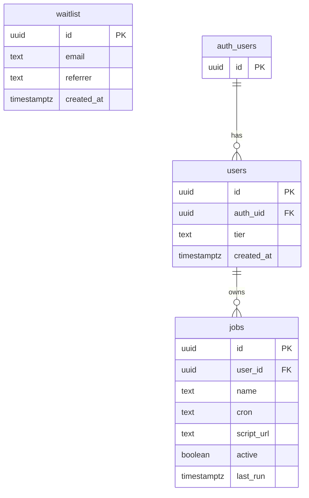

# CronDeck Database Schema

This document outlines the database schema for CronDeck, including tables, relationships, and Row Level Security (RLS) policies.

## Entity Relationship Diagram



## Tables

### waitlist

Stores emails of users who have signed up for the waitlist before authentication.

| Column | Type | Description |
|--------|------|-------------|
| id | uuid | Primary key, auto-generated |
| email | text | User's email address (unique) |
| referrer | text | Optional referrer information |
| created_at | timestamptz | Timestamp when record was created |

### users

Stores authenticated users and their subscription tier information.

| Column | Type | Description |
|--------|------|-------------|
| id | uuid | Primary key, auto-generated |
| auth_uid | uuid | Foreign key to auth.users table |
| tier | text | Subscription tier (default: 'free_beta') |
| created_at | timestamptz | Timestamp when record was created |

### jobs

Stores cron job metadata for users.

| Column | Type | Description |
|--------|------|-------------|
| id | uuid | Primary key, auto-generated |
| user_id | uuid | Foreign key to users table |
| name | text | Name of the cron job |
| cron | text | Cron expression (e.g., "0 0 * * *") |
| script_url | text | URL to the script to be executed |
| active | boolean | Whether the job is active (default: true) |
| last_run | timestamptz | Timestamp of last execution (nullable) |

## Row Level Security (RLS) Policies

CronDeck implements Row Level Security to ensure users can only access their own data:

### jobs table

```sql
alter table public.jobs enable row level security;

create policy "Users can manage their own jobs"
  on public.jobs
  for all
  using (
    user_id in (
      select id from public.users
      where auth_uid = auth.uid()
    )
  );
```

This policy ensures that users can only select, insert, update, or delete jobs that belong to them, enforcing data isolation and security. The policy works by:

1. Finding the user's record in the `public.users` table using their authenticated `auth.uid()`
2. Checking if the job's `user_id` matches the user's `id` from the `public.users` table
3. Only allowing access if there's a match

## Authentication

CronDeck uses Supabase Auth with email magic links as the primary authentication method. When a user signs up:

1. A record is created in the `auth.users` table (managed by Supabase)
2. A corresponding record is created in the `public.users` table with a reference to the auth user
3. The user is assigned the 'free_beta' tier by default

## Future Enhancements

Planned schema enhancements:

1. Add `job_runs` table to track execution history
2. Add `notifications` table for alerting on job failures
3. Add team/organization support for collaborative job management 